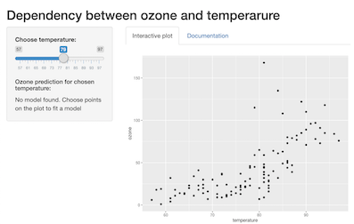

```{r setup, include=FALSE}
knitr::opts_chunk$set(echo = FALSE)
```

## Introduction {data-background=back.jpg data-background-size=cover}
This is a description of the project "Dependency between ozone and temperature".
This project is the final project on [Developing Data Products](https://www.coursera.org/learn/data-products?) course from Coursera.

Resulting interactive plot is available [here](https://olarinav.shinyapps.io/interactiveplot/).

Data is taken from *ozone* dataset from *ElemStatLearn* package.

Background image for this presentation is taken from *thehubpwoc.net* site.

## Description {data-background=back.jpg data-background-size=cover}

User opens a web-page with an interactive plot (ozone~temperature) and slider (temperature).

```{r}
library(ElemStatLearn)
data("ozone")
```

User can set:

1. Temperature for which ozone levels should be predicted - with slider;
2. Observations which will be used for model a fit - just pick out from the plot.

## Description {data-background=back.jpg data-background-size=cover}

Results:

1. User get predicted ozone value;
2. Regression line and confidence interval appear on the plot. Smooth method is loess;
3. Red point, displaying prediction, appears on the plot.

Restrictions:

1. If user chooses less than 2 points - prediction can not be built;
2. If chosen points are too far from the chosen with slider temperature - prediction
can not be done for this temperature.

##  Summary {data-background=back.jpg data-background-size=cover}
User can see that prediction highly depends on selected observations. I'd like
to demonstate this point now. I'll take 2 random samples of the data, fit 2 models
- and predict, just like in my app, but for fixed temperature 60.
```{r}
set.seed(123)
data1 = ozone[sample(1:111, size = 30),]
set.seed(666)
data2 = ozone[sample(1:111, size = 30),]
fit1 = loess(ozone~temperature, data = data1)
fit2 = loess(ozone~temperature, data = data2)
```
```{r, comment="", echo = TRUE}
nd = data.frame(temperature = 60)
predict(fit1, newdata = nd)
predict(fit2, newdata = nd)
```

            
